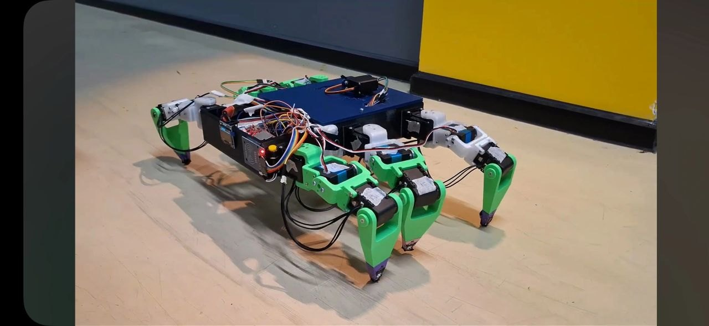
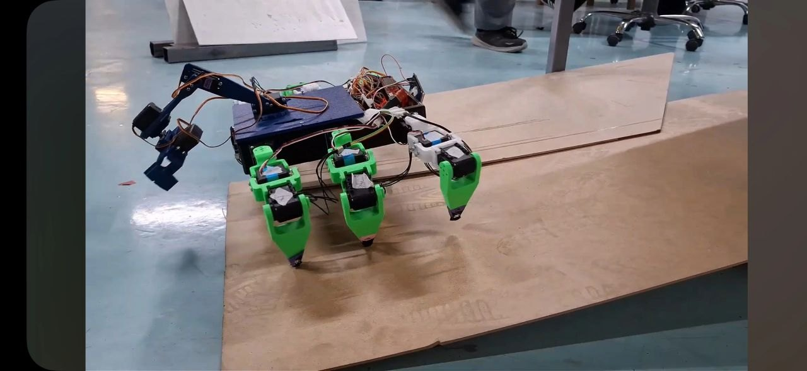

# SpyderRobot

Altı bacaklı ve her bacağında üç eklem bulunan yürüyen robot projesi. Toplam 18 servo motorla çalışan robotun yürüyüş kontrolü önce Webots simülasyon ortamında geliştirildi, ardından gerçek donanıma aktarıldı.

## Robot

| Bileşen | Açıklama |
| --- | --- |
| Yapı | 6 bacak, her bacakta coxa, femur ve tibia eklemleri |
| Motorlar | Toplam 18 servo motor |
| Alt seviye kontrol | Arduino Mega 2560 |
| Kontrol | Ters kinematik tabanlı yürüyüş kontrolü |
| Simülasyon | Webots |

## Yazılım

Robotun bacak konumları ters kinematik ile hesaplanıyor. Bacaklar iki grup hâlinde hareket ederek basma ve salınım fazları arasında geçiş yapıyor. Simülasyonda test edilen yürüyüş yapısı, motor kalibrasyonları ve mekanik sınırlar dikkate alınarak gerçek robota aktarıldı.

## Projedeki Katkım

Projede simülasyon ve optimizasyon aşamasında görev aldım. Webots ortamında robotun yürüyüş davranışlarının test edilmesi, eklem hareketlerinin gözlemlenmesi ve yürüyüş parametrelerinin daha kararlı hareket sağlayacak şekilde iyileştirilmesi üzerinde çalıştım.

## Gerçek Robot Testleri

Simülasyonda geliştirilen hareket yapısı gerçek robota aktarıldı ve düz zemin ile rampa üzerinde yürüyüş testleri gerçekleştirildi.

## Not

Bu depo, ekip olarak geliştirdiğimiz hexapod robotu ve projedeki kişisel katkılarımı tanıtmak amacıyla hazırlanmıştır. Projenin kaynak kodları ortak çalışma alanında tutulduğu için burada paylaşılmamaktadır.
